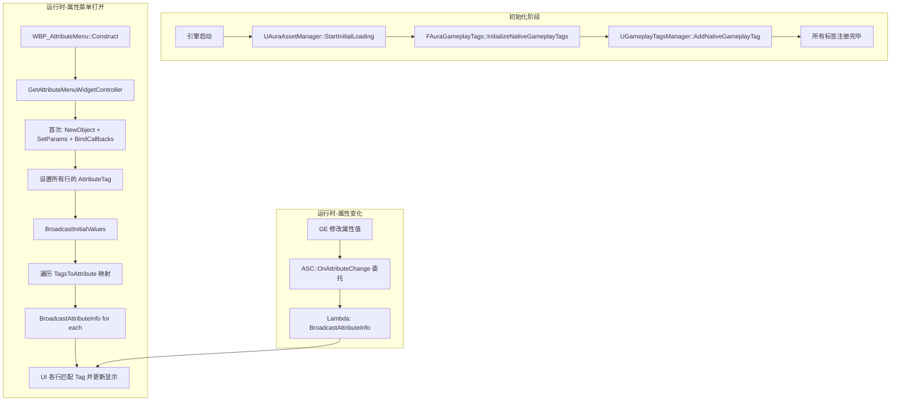

<a id="section-1"></a>
# UE5 学习笔记 — 第十四次提交（第9章：AttributeMenu 属性菜单系统）

> 📦 Commit `d5dabe4`：完成了整个 AttributeMenu  
> 📅 日期：2026-07-19  
> 🎬 对应视频：9.11~9.21（第9章后半部分 — 属性菜单核心实现）

---

<a id="section-2"></a>
## 目录

- [UE5 学习笔记 — 第十四次提交（第9章：AttributeMenu 属性菜单系统）](#section-1)
  - [目录](#section-2)
  - [一、整体目标：构建属性菜单 UI 系统](#section-3)
  - [二、技术栈总览](#section-4)
  - [三、原生 GameplayTag 单例体系（9.11~9.13）](#section-5)
    - [3.1 为什么需要原生 GameplayTag](#section-6)
    - [3.2 单例模式设计：FAuraGameplayTags](#section-7)
    - [3.3 初始化时机：AuraAssetManager（9.12）](#section-8)
    - [3.4 完整标签清单（9.13）](#section-9)
  - [四、DataAsset 驱动属性信息（9.14）](#section-10)
    - [4.1 UDataAsset 的优势](#section-11)
    - [4.2 FAuraAttributeInfo 结构体设计](#section-12)
    - [4.3 UAttributeInfo 数据资产与查找函数](#section-13)
  - [五、WidgetController 架构扩展（9.15~9.17）](#section-14)
    - [5.1 AttributeMenuWidgetController 子类（9.15）](#section-15)
    - [5.2 AuraHUD 扩展（9.17）](#section-16)
    - [5.3 蓝图函数库：AuraAbilitySystemLibrary（9.16）](#section-17)
  - [六、GameplayTag → Attribute 映射系统（9.20）](#section-18)
    - [6.1 核心问题：如何用 Tag 找到对应的 Attribute](#section-19)
    - [6.2 静态函数指针委托（TStaticFuncPtr）](#section-20)
    - [6.3 TagsToAttribute 映射表](#section-21)
  - [七、属性广播与动态更新（9.18~9.21）](#section-22)
    - [7.1 委托声明：FAttributeInfoSignature（9.18）](#section-23)
    - [7.2 BroadcastInitialValues 通用循环（9.20）](#section-24)
    - [7.3 BindCallbacksToDependencies Lambda 捕获（9.21）](#section-25)
  - [八、蓝图端实现（9.19）](#section-26)
    - [8.1 TextValueRow 添加 AttributeTag 变量](#section-27)
    - [8.2 属性菜单初始化流程](#section-28)
  - [九、新增/修改文件清单](#section-29)
    - [新增文件（C++）](#section-30)
    - [修改文件（C++）](#section-31)
    - [配置文件修改](#section-32)
  - [十、知识点总结](#section-33)
    - [核心设计模式](#section-34)
    - [关键技术点](#section-35)
    - [数据流向图](#section-36)

---

<a id="section-3"></a>
## 一、整体目标：构建属性菜单 UI 系统

本次提交的核心目标是实现一个**属性菜单（Attribute Menu）**，展示角色所有属性的名称、描述和当前数值，并在属性变化时实时更新。完整的数据链路如下：

```
GameplayEffect 修改属性值
    ↓ ASC 触发 OnAttributeChange 委托
AttributeMenuWidgetController (Lambda 捕获)
    ↓ 遍历 TagsToAttribute 映射表
    ↓ 通过 Tag 查找 UAttributeInfo DataAsset
    ↓ 获取 FAuraAttributeInfo（名称 + 描述）
    ↓ 填充当前值 → 广播 AttributeInfoDelegate
WBP_AttributeMenu（蓝图绑定）
    ↓ 各 TextValueRow 检查 AttributeTag 是否匹配
    ↓ 更新对应行的文本和数值显示
```

---

<a id="section-4"></a>
## 二、技术栈总览

| 层级 | 技术/模式 | 用途 |
|------|-----------|------|
| **Tag 管理** | 单例 + 原生 GameplayTag | C++ 中集中管理所有属性标签，避免字符串硬编码 |
| **初始化时机** | AuraAssetManager::StartInitialLoading | 在引擎早期加载阶段注册所有原生标签 |
| **数据驱动** | UDataAsset（UAttributeInfo） | 在蓝图中配置属性名称、描述，C++ 中查找 |
| **控制器架构** | MVC — WidgetController 继承体系 | AttributeMenuWidgetController 继承 UAuraWidgetController |
| **函数库** | BlueprintFunctionLibrary | AuraAbilitySystemLibrary 提供蓝图可调用的静态函数 |
| **Tag→Attribute 映射** | TMap + 静态函数指针委托 | 通过 GameplayTag 找到对应的 GetXxxAttribute 访问器 |
| **属性变更监听** | ASC 的 GetGameplayAttributeValueChangeDelegate | 绑定 Lambda，属性变化时自动广播 |
| **蓝图 UI 匹配** | 每行 Widget 持有 AttributeTag 变量 | 收到广播后，各行自行判断是否匹配并更新 |

---

<a id="section-5"></a>
## 三、原生 GameplayTag 单例体系（9.11~9.13）

<a id="section-6"></a>
### 3.1 为什么需要原生 GameplayTag

**痛点：** 之前使用 `RequestGameplayTag("Attributes.Vital.Health")` 方式获取标签，存在以下问题：
- 每次需要标签时都要手动输入字符串
- 容易拼写错误，且编译期无法检查
- 标签分散在各处，没有集中管理

**解决方案：** 创建原生（Native）GameplayTag，在 C++ 中通过 `UGameplayTagsManager::AddNativeGameplayTag()` 注册，存储为结构体成员变量，实现类型安全的标签引用。

```cpp
// ❌ 旧方式：字符串硬编码，容易出错
FGameplayTag HealthTag = UGameplayTagsManager::Get().RequestGameplayTag(FName("Attributes.Vital.Health"));

// ✅ 新方式：类型安全的变量引用
const FAuraGameplayTags& Tags = FAuraGameplayTags::Get();
FGameplayTag HealthTag = Tags.Attribute_Primary_Strength;
```

<a id="section-7"></a>
### 3.2 单例模式设计：FAuraGameplayTags

采用**结构体 + 静态单例**模式，而非 UObject 派生类：

```cpp
// AuraGameplayTags.h
struct FAuraGameplayTags
{
public:
    static const FAuraGameplayTags& Get() { return GameplayTags; }
    static void InitializeNativeGameplayTags();

    // 主要属性标签
    FGameplayTag Attribute_Primary_Strength;
    FGameplayTag Attribute_Primary_Intelligence;
    FGameplayTag Attribute_Primary_Resilience;
    FGameplayTag Attribute_Primary_Vigor;

    // 次要属性标签
    FGameplayTag Attribute_Secondary_Armor;
    FGameplayTag Attribute_Secondary_ArmorPenetration;
    FGameplayTag Attribute_Secondary_BlockChance;
    FGameplayTag Attribute_Secondary_CriticalHitChance;
    FGameplayTag Attribute_Secondary_CriticalHitDamage;
    FGameplayTag Attribute_Secondary_CriticalHitResistance;
    FGameplayTag Attribute_Secondary_HealthRegeneration;
    FGameplayTag Attribute_Secondary_ManaRegeneration;
    FGameplayTag Attribute_Secondary_MaxHealth;
    FGameplayTag Attribute_Secondary_MaxMana;

private:
    static FAuraGameplayTags GameplayTags;  // 唯一实例
};
```

**单例实现要点：**
- `Get()` 是静态函数，返回 `GameplayTags` 的唯一引用
- `GameplayTags` 是私有静态成员，确保全局只有一个实例
- `InitializeNativeGameplayTags()` 是静态函数，无需实例即可调用

**初始化实现（AuraGameplayTags.cpp）：**

```cpp
void FAuraGameplayTags::InitializeNativeGameplayTags()
{
    // 通过 GameplayTagsManager 注册原生标签
    GameplayTags.Attribute_Primary_Strength = UGameplayTagsManager::Get().AddNativeGameplayTag(
        FName("Attributes.Primary.Strength"),
        FString("Increase Physical Damage")
    );

    GameplayTags.Attribute_Primary_Intelligence = UGameplayTagsManager::Get().AddNativeGameplayTag(
        FName("Attributes.Primary.Intelligence"),
        FString("Increase Magical Damage")
    );
    // ... 其余标签类似
}
```

> **关键理解：** `AddNativeGameplayTag` 会将标签注册到全局 GameplayTagsManager，同时返回 `FGameplayTag` 变量。这些标签在编辑器的项目设置中也会显示为"Native"。

<a id="section-8"></a>
### 3.3 初始化时机：AuraAssetManager（9.12）

**问题：** `InitializeNativeGameplayTags()` 需要在引擎早期调用，但必须在 GameplayTagsManager 初始化之后。

**解决方案：** 创建自定义 `UAuraAssetManager`，重写 `StartInitialLoading()`，在该时机调用标签初始化。

```cpp
// AuraAssetManager.h
UCLASS()
class AURA_API UAuraAssetManager : public UAssetManager
{
    GENERATED_BODY()
public:
    static UAuraAssetManager& Get();

protected:
    virtual void StartInitialLoading() override;
};

// AuraAssetManager.cpp
void UAuraAssetManager::StartInitialLoading()
{
    Super::StartInitialLoading();           // 先调用父类
    FAuraGameplayTags::InitializeNativeGameplayTags();  // 注册所有原生标签
}

UAuraAssetManager& UAuraAssetManager::Get()
{
    check(GEngine);
    UAuraAssetManager* AuraAssetManager = Cast<UAuraAssetManager>(GEngine->AssetManager);
    return *AuraAssetManager;
}
```

**配置注册（DefaultEngine.ini）：**

```ini
[/Script/Engine.Engine]
AssetManagerClassName=/Script/Aura.AuraAssetManager
```

> **关键理解：** `AssetManager` 是 UE 引擎级别的单例，通过 `DefaultEngine.ini` 指定自定义子类后，引擎启动时会自动创建该子类的唯一实例。`StartInitialLoading()` 在所有资产加载之前调用，是注册原生标签的最佳时机。

<a id="section-9"></a>
### 3.4 完整标签清单（9.13）

| 分类 | 标签名 | 描述 |
|------|--------|------|
| **主要属性** | `Attributes.Primary.Strength` | 增加物理伤害 |
| | `Attributes.Primary.Intelligence` | 增加魔法伤害 |
| | `Attributes.Primary.Resilience` | 增加护甲和穿透 |
| | `Attributes.Primary.Vigor` | 增加最大生命值 |
| **次要属性** | `Attributes.Secondary.Armor` | 减少伤害，提高格挡几率 |
| | `Attributes.Secondary.ArmorPenetration` | 忽略敌人护甲，增加暴击伤害 |
| | `Attributes.Secondary.BlockChance` | 几率减半受到的伤害 |
| | `Attributes.Secondary.CriticalHitChance` | 几率触发双倍+暴击加成 |
| | `Attributes.Secondary.CriticalHitDamage` | 暴击时的额外伤害 |
| | `Attributes.Secondary.CriticalHitResistance` | 降低敌人的暴击几率 |
| | `Attributes.Secondary.HealthRegeneration` | 每秒生命恢复量 |
| | `Attributes.Secondary.ManaRegeneration` | 每秒法力恢复量 |
| | `Attributes.Secondary.MaxHealth` | 最大生命值 |
| | `Attributes.Secondary.MaxMana` | 最大法力值 |

> **重构说明：** 将 `MaxHealth` 和 `MaxMana` 从 Vital 类别移动到 Secondary 类别，因为它们本质上是派生属性而非核心属性。

---

<a id="section-10"></a>
## 四、DataAsset 驱动属性信息（9.14）

<a id="section-11"></a>
### 4.1 UDataAsset 的优势

`UDataAsset` 是 UE 中存储配置数据的轻量级资产类型，非常适合属性菜单场景：

| 特性 | 说明 |
|------|------|
| **蓝图可编辑** | 策划/设计师可在编辑器中直接填写数据 |
| **单一实例** | 同一份数据多处引用，修改即全局生效 |
| **类型安全** | C++ 定义结构体，蓝图填充，编译期类型检查 |
| **无需 Actor** | 不依赖世界实例，纯数据层 |

<a id="section-12"></a>
### 4.2 FAuraAttributeInfo 结构体设计

```cpp
// AttributeInfo.h
USTRUCT(BlueprintType)
struct FAuraAttributeInfo
{
    GENERATED_BODY()

    // 标识属性的 GameplayTag（关键：用于匹配）
    UPROPERTY(EditDefaultsOnly, BlueprintReadOnly)
    FGameplayTag AttributeTag = FGameplayTag();

    // 显示在 UI 上的属性名称
    UPROPERTY(EditDefaultsOnly, BlueprintReadOnly)
    FText AttributeName = FText();

    // 属性的描述文本
    UPROPERTY(EditDefaultsOnly, BlueprintReadOnly)
    FText AttributeDescription = FText();

    // 当前数值（运行时填充，不在数据资产中配置）
    UPROPERTY(BlueprintReadOnly)
    float AttributeValue = 0.0f;
};
```

**设计要点：**
- `AttributeTag` 是关键的匹配键，用于在运行时将广播与对应的 UI 行关联
- `AttributeName` 和 `AttributeDescription` 使用 `FText` 而非 `FString`，因为要显示给用户（支持本地化）
- `AttributeValue` 标记为 `BlueprintReadOnly`（非 `EditDefaultsOnly`），因为它在运行时由 C++ 填充，不在数据资产中手动配置

<a id="section-13"></a>
### 4.3 UAttributeInfo 数据资产与查找函数

```cpp
// AttributeInfo.h
UCLASS()
class AURA_API UAttributeInfo : public UDataAsset
{
    GENERATED_BODY()
public:
    // 根据 Tag 查找对应的属性信息
    FAuraAttributeInfo FindAttributeInfoForTag(const FGameplayTag& AttributeTag, bool bLogNotFound = true) const;

    // 在蓝图中填充的属性信息数组
    UPROPERTY(EditDefaultsOnly, BlueprintReadOnly)
    TArray<FAuraAttributeInfo> AttributeInformation;
};
```

**查找实现（顺序遍历）：**

```cpp
FAuraAttributeInfo UAttributeInfo::FindAttributeInfoForTag(const FGameplayTag& AttributeTag, bool bLogNotFound) const
{
    for (const FAuraAttributeInfo& Info : AttributeInformation)
    {
        if (Info.AttributeTag.MatchesTagExact(AttributeTag))
        {
            return Info;
        }
    }

    if (bLogNotFound)
    {
        UE_LOG(LogTemp, Error, TEXT("Can't find Info for AttributeTag [%s] on AttributeInfo [%s]."),
            *AttributeTag.ToString(), *GetNameSafe(this));
    }

    return FAuraAttributeInfo();
}
```

> **关键理解：** 使用 `MatchesTagExact` 而非 `MatchesTag`，确保精确匹配（不匹配父标签）。数据资产在蓝图中手动创建，每条记录填入 Tag、Name、Description 三元组。

---

<a id="section-14"></a>
## 五、WidgetController 架构扩展（9.15~9.17）

<a id="section-15"></a>
### 5.1 AttributeMenuWidgetController 子类（9.15）

继承自 `UAuraWidgetController`，专门服务于属性菜单：

```cpp
// AttributeMenuWidgetController.h
UCLASS(BlueprintType, Blueprintable)
class AURA_API UAttributeMenuWidgetController : public UAuraWidgetController
{
    GENERATED_BODY()
public:
    virtual void BindCallbacksToDependencies() override;
    virtual void BroadcastInitialValues() override;

    // 广播属性信息的委托（蓝图动态多播）
    UPROPERTY(BlueprintAssignable, Category="GAS|Attribute")
    FAttributeInfoSignature AttributeInfoDelegate;

protected:
    // 在蓝图中设置的属性信息数据资产
    UPROPERTY(EditDefaultsOnly)
    TObjectPtr<UAttributeInfo> AttributeInfo;

private:
    void BroadcastAttributeInfo(const FGameplayTag& AttributeTag, const FGameplayAttribute& Attribute) const;
};
```

**继承关系：**
```
UObject
  └── UAuraWidgetController (基类：持有 PC, PS, ASC, AS)
        ├── UOverlayWidgetController (Overlay 层)
        └── UAttributeMenuWidgetController (属性菜单)
```

<a id="section-16"></a>
### 5.2 AuraHUD 扩展（9.17）

在 `AAuraHUD` 中添加属性菜单控制器的单例管理：

```cpp
// AuraHUD.h
class AURA_API AAuraHUD : public AHUD
{
public:
    UOverlayWidgetController* GetOverlayWidgetController(const FWidgetControllerParams& WCParams);
    UAttributeMenuWidgetController* GetAttributeMenuWidgetController(const FWidgetControllerParams& WCParams);

private:
    // 属性菜单控制器（单例模式，只创建一次）
    UPROPERTY()
    TObjectPtr<UAttributeMenuWidgetController> AttributeMenuWidgetController;

    // 在蓝图中设置的控制器类
    UPROPERTY(EditAnywhere)
    TSubclassOf<UAttributeMenuWidgetController> AttributeMenuWidgetControllerClass;
};
```

**Getter 实现（与 OverlayWidgetController 相同的单例模式）：**

```cpp
UAttributeMenuWidgetController* AAuraHUD::GetAttributeMenuWidgetController(const FWidgetControllerParams& WCParams)
{
    if (AttributeMenuWidgetController == nullptr)
    {
        AttributeMenuWidgetController = NewObject<UAttributeMenuWidgetController>(this, AttributeMenuWidgetControllerClass);
        AttributeMenuWidgetController->SetWidgetControllerParams(WCParams);
        AttributeMenuWidgetController->BindCallbacksToDependencies();
    }
    return AttributeMenuWidgetController;
}
```

> **设计模式：** 延迟初始化（Lazy Initialization）—— 首次请求时才创建，之后始终返回同一实例。这确保了属性菜单控制器在整个会话中的单例性。

<a id="section-17"></a>
### 5.3 蓝图函数库：AuraAbilitySystemLibrary（9.16）

**动机：** 让蓝图能够轻松获取 WidgetController，无需通过复杂的 HUD 查找链。

**设计：** 创建 `UBlueprintFunctionLibrary` 子类，提供静态蓝图纯函数：

```cpp
// AuraAbilitySystemLibrary.h
UCLASS()
class AURA_API UAuraAbilitySystemLibrary : public UBlueprintFunctionLibrary
{
    GENERATED_BODY()
public:
    // 获取 Overlay WidgetController
    UFUNCTION(BlueprintPure, Category="AuraAbilitySystemLibrary|WidgetController")
    static UOverlayWidgetController* GetOverlayWidgetController(const UObject* WorldContextObject);

    // 获取 AttributeMenu WidgetController
    UFUNCTION(BlueprintPure, Category="AuraAbilitySystemLibrary|WidgetController")
    static UAttributeMenuWidgetController* GetAttributeMenuWidgetController(const UObject* WorldContextObject);
};
```

**实现路径（以 AttributeMenu 为例）：**

```cpp
UAttributeMenuWidgetController* UAuraAbilitySystemLibrary::GetAttributeMenuWidgetController(const UObject* WorldContextObject)
{
    // 1. 通过 WorldContextObject 获取 PlayerController
    if (APlayerController* PC = UGameplayStatics::GetPlayerController(WorldContextObject, 0))
    {
        // 2. 通过 PlayerController 获取 HUD
        if (AAuraHUD* AuraHUD = Cast<AAuraHUD>(PC->GetHUD()))
        {
            // 3. 组装 WidgetControllerParams
            AAuraPlayerState* PS = PC->GetPlayerState<AAuraPlayerState>();
            UAbilitySystemComponent* ASC = PS->GetAbilitySystemComponent();
            UAttributeSet* AS = PS->GetAttributeSet();
            const FWidgetControllerParams WidgetControllerParams(PC, PS, ASC, AS);

            // 4. 通过 HUD 的 Getter 获取/创建 WidgetController
            return AuraHUD->GetAttributeMenuWidgetController(WidgetControllerParams);
        }
    }
    return nullptr;
}
```

**调用链路：**
```
蓝图节点 (BlueprintPure)
  → UAuraAbilitySystemLibrary::GetAttributeMenuWidgetController(WorldContextObject)
    → UGameplayStatics::GetPlayerController(WorldContextObject)
      → Cast<AAuraHUD>(PC->GetHUD())
        → AuraHUD->GetAttributeMenuWidgetController(Params)
          → 首次调用：NewObject + SetParams + BindCallbacks
          → 后续调用：直接返回已有实例
```

> **关键理解：** `WorldContextObject` 是 UE 蓝图函数库的常见模式。因为静态函数无法直接访问世界中的对象，需要一个"锚点"来追踪到 PlayerController → HUD → WidgetController。

---

<a id="section-18"></a>
## 六、GameplayTag → Attribute 映射系统（9.20）

<a id="section-19"></a>
### 6.1 核心问题：如何用 Tag 找到对应的 Attribute

在属性菜单中，我们需要实现一个通用循环：

```
对于每个属性：
  1. 获取它的 GameplayTag
  2. 获取它的当前值
  3. 广播 Tag + 值 给 UI
```

**难题：** `UAuraAttributeSet` 中每个属性都有独立的 getter（`GetStrengthAttribute()`、`GetIntelligenceAttribute()` 等），如何在一个通用循环中调用正确的 getter？

<a id="section-20"></a>
### 6.2 静态函数指针委托（TStaticFuncPtr）

利用 `ATTRIBUTE_ACCESSORS` 宏生成的静态 `GetXxxAttribute()` 函数，这些函数的签名完全一致：**无参数，返回 `FGameplayAttribute`**。

```cpp
// 声明一个委托类型，匹配 GetXxxAttribute 的函数签名
// 返回类型: FGameplayAttribute
// 参数: 无
DECLARE_DELEGATE_RetVal(FGameplayAttribute, FAttributeSignature);

// 类型别名：指向静态函数的指针
// TStaticFuncPtr 是 UE 提供的模板，用于绑定静态成员函数
template<class T>
using TStaticFuncPtr = typename TBaseStaticDelegateInstance<T, FDefaultDelegateUserPolicy>::FFuncPtr;
```

<a id="section-21"></a>
### 6.3 TagsToAttribute 映射表

在 `UAuraAttributeSet` 中建立映射：

```cpp
// AuraAttributeSet.h
public:
    TMap<FGameplayTag, TStaticFuncPtr<FGameplayAttribute()>> TagsToAttribute;
```

**在构造函数中填充映射：**

```cpp
UAuraAttributeSet::UAuraAttributeSet()
{
    const FAuraGameplayTags& GameplayTags = FAuraGameplayTags::Get();

    // 主要属性
    TagsToAttribute.Add(GameplayTags.Attribute_Primary_Strength, GetStrengthAttribute);
    TagsToAttribute.Add(GameplayTags.Attribute_Primary_Intelligence, GetIntelligenceAttribute);
    TagsToAttribute.Add(GameplayTags.Attribute_Primary_Resilience, GetResilienceAttribute);
    TagsToAttribute.Add(GameplayTags.Attribute_Primary_Vigor, GetVigorAttribute);

    // 次要属性
    TagsToAttribute.Add(GameplayTags.Attribute_Secondary_Armor, GetArmorAttribute);
    TagsToAttribute.Add(GameplayTags.Attribute_Secondary_ArmorPenetration, GetArmorPenetrationAttribute);
    // ... 其余 8 个次要属性
}
```

> **关键理解：** `GetStrengthAttribute` 等函数是 `ATTRIBUTE_ACCESSORS` 宏自动生成的静态函数。它们被存储为函数指针，后续通过 `Pair.Value()()` 调用即可获取对应的 `FGameplayAttribute`。这个映射表是整个属性菜单系统的核心枢纽。

---

<a id="section-22"></a>
## 七、属性广播与动态更新（9.18~9.21）

<a id="section-23"></a>
### 7.1 委托声明：FAttributeInfoSignature（9.18）

```cpp
// 动态多播委托：一个参数（const FAuraAttributeInfo&）
DECLARE_DYNAMIC_MULTICAST_DELEGATE_OneParam(FAttributeInfoSignature, const FAuraAttributeInfo&, Info);
```

- **Dynamic**：蓝图可绑定
- **Multicast**：多个监听者（每个属性行 Widget 各自绑定）
- **OneParam**：广播一个 `FAuraAttributeInfo` 结构体

<a id="section-24"></a>
### 7.2 BroadcastInitialValues 通用循环（9.20）

**核心思路：** 不手动为每个属性写重复代码，而是遍历 `TagsToAttribute` 映射表，一次性广播所有属性。

```cpp
void UAttributeMenuWidgetController::BroadcastInitialValues()
{
    const UAuraAttributeSet* AS = Cast<UAuraAttributeSet>(AttributeSet);
    check(AttributeInfo);

    // 遍历 TagsToAttribute 映射表
    for (auto& Pair : AS->TagsToAttribute)
    {
        // Pair.Key:   FGameplayTag（如 "Attributes.Primary.Strength"）
        // Pair.Value: 函数指针（如 &GetStrengthAttribute）
        BroadcastAttributeInfo(Pair.Key, Pair.Value());
    }
}
```

**`BroadcastAttributeInfo` 辅助函数：**

```cpp
void UAttributeMenuWidgetController::BroadcastAttributeInfo(
    const FGameplayTag& AttributeTag, const FGameplayAttribute& Attribute) const
{
    // 1. 从 DataAsset 查找属性元数据（名称、描述）
    FAuraAttributeInfo Info = AttributeInfo->FindAttributeInfoForTag(AttributeTag);

    // 2. 从 AttributeSet 获取当前数值
    Info.AttributeValue = Attribute.GetNumericValue(AttributeSet);

    // 3. 广播给所有绑定的 Widget
    AttributeInfoDelegate.Broadcast(Info);
}
```

> **设计优势：** 以后添加新属性时，只需在 `TagsToAttribute` 映射中添加一行，无需修改广播逻辑。实现了**开闭原则（OCP）**。

<a id="section-25"></a>
### 7.3 BindCallbacksToDependencies Lambda 捕获（9.21）

**问题：** 属性值变化时需要实时更新 UI，不能只依赖初始广播。

**解决方案：** 利用 ASC 的 `GetGameplayAttributeValueChangeDelegate` 为每个属性绑定 Lambda：

```cpp
void UAttributeMenuWidgetController::BindCallbacksToDependencies()
{
    const UAuraAttributeSet* AS = Cast<UAuraAttributeSet>(AttributeSet);
    check(AttributeInfo);

    for (auto& Pair : AS->TagsToAttribute)
    {
        // 为每个属性绑定属性变化回调
        AbilitySystemComponent->GetGameplayAttributeValueChangeDelegate(Pair.Value()).AddLambda(
            [this, Pair](const FOnAttributeChangeData& Data)
            {
                // Pair 按值捕获（Lambda 持有副本）
                // 当属性变化时，广播新的属性信息
                BroadcastAttributeInfo(Pair.Key, Pair.Value());
            }
        );
    }
}
```

**Lambda 捕获的关键细节：**

| 捕获方式 | 适用性 | 说明 |
|----------|--------|------|
| `[&Pair]` | ❌ 不可用 | `Pair` 是 for 循环的局部变量，Lambda 执行时已超出作用域 |
| `[Pair]` | ✅ 正确 | 按值捕获，Lambda 持有 `Pair` 的副本，生命周期独立 |

> **关键理解：** 这是一个经典的 C++ Lambda 捕获陷阱。for 循环中的局部变量如果按引用捕获，Lambda 延迟执行时会访问已销毁的栈内存，导致未定义行为。按值捕获确保 Lambda 持有独立副本。

---

<a id="section-26"></a>
## 八、蓝图端实现（9.19）

<a id="section-27"></a>
### 8.1 TextValueRow 添加 AttributeTag 变量

在 `WBP_TextValueRow` 基类蓝图中添加 `AttributeTag` 变量（类型：`FGameplayTag`），使每一行都能自我识别：

```
WBP_TextValueRow
  ├── AttributeTag (FGameplayTag)  ← 新增：标识此行的属性
  ├── Label (TextBlock)            ← 属性名称
  └── Value (TextBlock)            ← 属性数值
```

<a id="section-28"></a>
### 8.2 属性菜单初始化流程

在 `WBP_AttributeMenu` 的事件图表中：

```
Event Construct
  │
  ├─ [Sequence 0] 绑定关闭按钮的 OnClicked
  │
  ├─ [Sequence 1] 设置 WidgetController
  │    └─ GetAttributeMenuWidgetController(WorldContextObject)
  │       → SetWidgetController(...)
  │
  ├─ [Sequence 2] 设置所有行的 AttributeTag
  │    └─ SetAttributeTags() 函数
  │       ├─ Row_Strength.AttributeTag = Attributes.Primary.Strength
  │       ├─ Row_Intelligence.AttributeTag = Attributes.Primary.Intelligence
  │       ├─ Row_Resilience.AttributeTag = Attributes.Primary.Resilience
  │       ├─ Row_Vigor.AttributeTag = Attributes.Primary.Vigor
  │       └─ ... (所有次要属性行)
  │
  └─ [Sequence 3] 广播初始值
       └─ WidgetController->BroadcastInitialValues()
```

**各行接收广播的逻辑：**

```
AttributeInfoDelegate.Broadcast(Info)
  → 每个 TextValueRow 的绑定回调触发
    → if (self.AttributeTag == Info.AttributeTag)
        → Label.Text = Info.AttributeName
        → Value.Text = Info.AttributeValue
```

---

<a id="section-29"></a>
## 九、新增/修改文件清单

<a id="section-30"></a>
### 新增文件（C++）

| 文件 | 说明 |
|------|------|
| `Public/AuraGameplayTags.h` | 原生 GameplayTag 单例结构体声明 |
| `Private/AuraGameplayTags.cpp` | 原生标签初始化实现 |
| `Public/AuraAssetManager.h` | 自定义 AssetManager 声明 |
| `Private/AuraAssetManager.cpp` | StartInitialLoading 中初始化标签 |
| `Public/AbilitySystem/Data/AttributeInfo.h` | FAuraAttributeInfo 结构体 + UAttributeInfo DataAsset |
| `Private/AbilitySystem/Data/AttributeInfo.cpp` | FindAttributeInfoForTag 查找实现 |
| `Public/UI/WidgetController/AttributeMenuWidgetController.h` | 属性菜单 WidgetController |
| `Private/UI/WidgetController/AttributeMenuWidgetController.cpp` | 广播初始值 + 绑定回调 |
| `Public/AbilitySystem/AuraAbilitySystemLibrary.h` | 蓝图函数库声明 |
| `Private/AbilitySystem/AuraAbilitySystemLibrary.cpp` | GetOverlayWidgetController + GetAttributeMenuWidgetController |

<a id="section-31"></a>
### 修改文件（C++）

| 文件 | 变更内容 |
|------|----------|
| `AuraAttributeSet.h` | 添加 `TagsToAttribute` 映射表 + `TStaticFuncPtr` 类型别名 |
| `AuraAttributeSet.cpp` | 构造函数中填充 TagsToAttribute 映射 |
| `AuraHUD.h` | 添加 `AttributeMenuWidgetController` 变量 + `AttributeMenuWidgetControllerClass` + Getter |
| `AuraHUD.cpp` | 实现 `GetAttributeMenuWidgetController` 单例逻辑 |
| `AuraWidgetController.h` | 修复 `AbilitySystemponent` → `AbilitySystemComponent` 拼写错误 |
| `AuraWidgetController.cpp` | 对应更新变量名 |
| `AuraAbilitySystemComponent.cpp` | 添加 `AuraGameplayTags.h` 头文件 |

<a id="section-32"></a>
### 配置文件修改

| 文件 | 变更 |
|------|------|
| `DefaultEngine.ini` | 添加 `AssetManagerClassName=/Script/Aura.AuraAssetManager` |
| `DefaultGameplayTags.ini` | 移除 `MaxHealth`/`MaxMana` 的旧标签定义；添加 `PropertyRedirects` |

---

<a id="section-33"></a>
## 十、知识点总结

<a id="section-34"></a>
### 核心设计模式

| 模式 | 应用场景 | 关键实现 |
|------|----------|----------|
| **单例模式** | `FAuraGameplayTags`、`UAuraAssetManager` | 静态私有实例 + 静态 Get() |
| **数据驱动** | `UAttributeInfo` DataAsset | 蓝图配置元数据，C++ 运行时查找 |
| **MVC 架构** | WidgetController 继承体系 | 每个 UI 面板对应一个专用 Controller |
| **函数库模式** | `UAuraAbilitySystemLibrary` | 静态蓝图函数简化跨层访问 |
| **映射表模式** | `TagsToAttribute` | Tag → 函数指针的 TMap |

<a id="section-35"></a>
### 关键技术点

1. **原生 GameplayTag vs 配置文件 Tag：** 原生 Tag 在 C++ 中注册，提供编译期类型安全；配置文件 Tag 更适合纯蓝图/策划配置的场景。

2. **AssetManager 的初始化时机：** `StartInitialLoading()` 在所有资产加载之前调用，是注册原生 Tag 的最佳时机。通过 `DefaultEngine.ini` 指定自定义 AssetManager 类。

3. **Lambda 按值捕获：** 在 for 循环中创建 Lambda 并绑定到委托时，必须按值捕获循环变量，否则 Lambda 执行时变量已超出作用域。

4. **DataAsset 的 AttributeValue 设计：** `AttributeValue` 不在 DataAsset 中配置，而是在运行时通过 `GetNumericValue(AttributeSet)` 动态获取。DataAsset 只存储静态元数据（名称、描述、Tag）。

5. **通用循环 vs 手动展开：** 通过 `TagsToAttribute` 映射表 + `for (auto& Pair : TagsToAttribute)` 实现通用循环，遵循开闭原则，添加新属性时无需修改广播逻辑。

6. **WidgetController 的单例管理：** 在 HUD 中使用"延迟初始化 + 缓存"模式，首次请求时创建，后续直接返回。确保整个会话中只有一个属性菜单控制器实例。

7. **蓝图函数库的 WorldContextObject 模式：** 静态函数无法直接访问世界对象，需要 `WorldContextObject` 作为追踪锚点，通过 `UGameplayStatics::GetPlayerController` 逐步获取所需对象。

<a id="section-36"></a>
### 数据流向图


